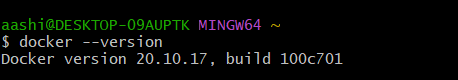

## Assignment 1
### 15 basic docker commands

#### 1. docker --version 
#### Explaination - It shows the version of docker installed in your local

#### 2. docker run -d -p 80:80 docker/getting-started
#### -d - run the container in detached mode (in the background)
#### -p 80:80 - map port 80 of the host to port 80 in the container
#### docker/getting-started - the image to use

#### 3. docker pull docker/getting-started
#### To pull (aka download) the docker image from docker hub to your local machine.

#### 4. docker images
#### To list all the docker images present in your local machine.

## Yeah buddy!! We have implemented 4 commands. Let's keep up the good work.

#### 5. docker ps
#### To list all the docker containers which are in running state in your local machine.

#### 6. docker ps --all
#### To list all the docker containers which are in running state as well as those are in stopped state in your local machine.

#### 7. docker stop
#### To stop a running container

#### Wow!! this is awesome. Like it is easy to start, run, stop and see the containers....

#### 8. docker stop
#### To restart a stopped container

#### 9. docker rename
#### To rename a container

#### 10. docker logs
#### To fetch the logs from a specified container

#### 11. docker rm
#### To remove container, first stop it and then remove it.

#### 12. docker rmi
#### Remove a image

#### 13. docker command --help 
#### To get help

#### 14. To run commands inside the container

#### 15. docker kill container_id
#### To kill the container immediately

#### Yayy!!!! Assignment 1 Done...

## Assignment 2
#### Hello World Docker Image Run Hello World Docker Image Locally.

## Assignment 3
#### Create a hello world flask application. Create a Dockerfile for your flask hello world application. Build Docker image using Docker file. Run docker image build in previous step. Push your Docker image to Docker Hub.

## Assignment 4
#### Automate Assignment below task using github action.
####
#### 1. Build Docker Image
#### 2. Push Docker Image to Docker hub.

